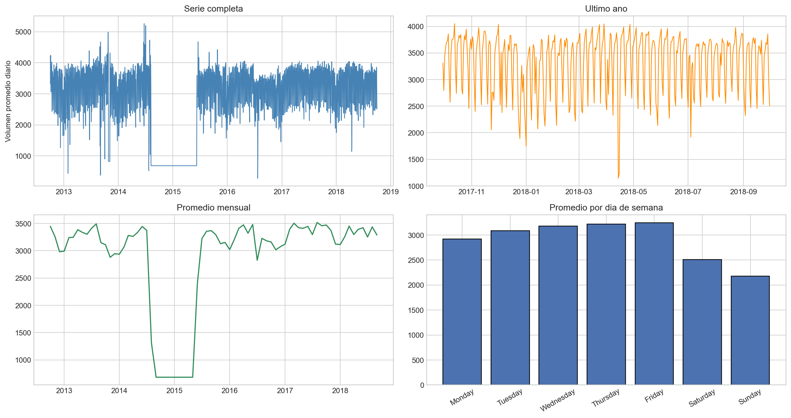
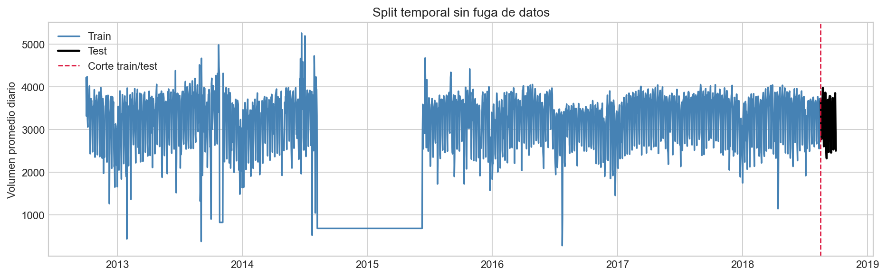
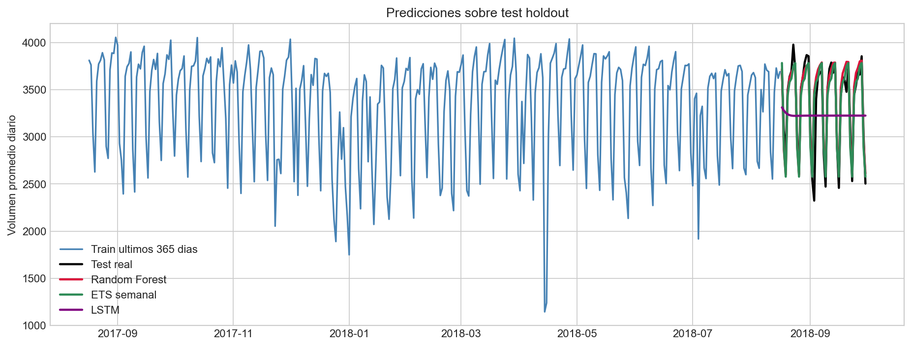
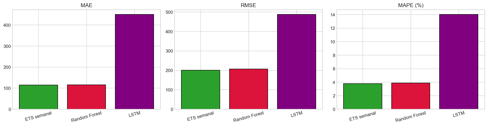
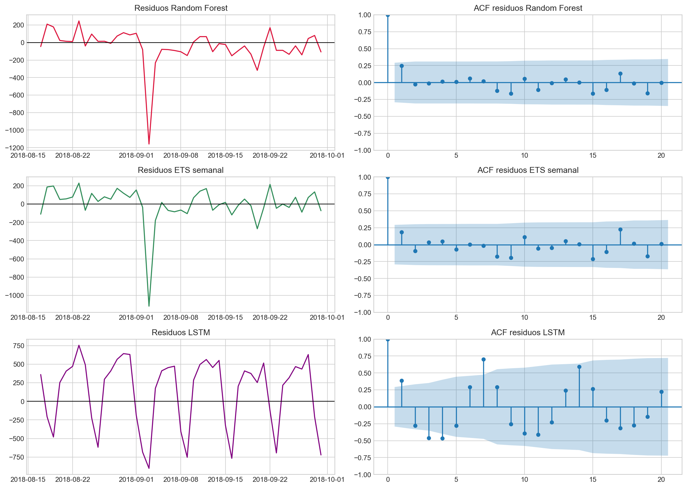

# Forecasting de volumen de trafico con series temporales

## Descripcion del problema

El objetivo es pronosticar el volumen promedio diario de trafico vehicular en la autopista I-94, a partir del dataset publico **Metro Interstate Traffic Volume**. El problema pertenece al dominio de transporte y se aborda como forecasting univariado con variables calendario conocidas a futuro.

## Dataset utilizado

- Fuente: [Kaggle - Metro Interstate Traffic Volume](https://www.kaggle.com/datasets/anshtanwar/metro-interstate-traffic-volume)
- Archivo: `data/Metro_Interstate_Traffic_Volume.csv`
- Observaciones horarias originales procesadas: 48,204
- Variable objetivo: `traffic_volume`
- Serie usada: promedio diario de `traffic_volume`
- Rango temporal diario: 2012-10-02 a 2018-09-30
- Observaciones diarias: 2,190

El dataset cumple los requisitos de la guia: tiene mas de 100 observaciones temporales, columna de fecha/hora y una variable numerica a predecir.

## Metodologia aplicada

1. Se parseo `date_time`, se ordeno la serie y se agrupo el trafico por fecha/hora.
2. Se transformo la frecuencia horaria a frecuencia diaria usando el promedio diario.
3. Se reservaron los ultimos 45 dias como test holdout no usado para seleccion de modelos.
4. La seleccion de ventana, lags e hiperparametros simples se hizo solo sobre train con backtesting temporal.
5. Las metricas finales se calcularon sobre el test holdout.

Split temporal:

- Train: 2012-10-02 a 2018-08-16 (2,145 dias)
- Test: 2018-08-17 a 2018-09-30 (45 dias)

## Modelos implementados

### Random Forest

Modelo de Machine Learning con target transformado por `log1p`, prediccion recursiva y features de calendario (`dow`, `month`, `doy_sin`, `doy_cos`). Se compararon ventanas de 180, 365, 730 dias y todo el historico; tambien se compararon conjuntos de lags de 7, 14, 28 dias e hibrido semanal.

- Mejor ventana: `todo_historico`
- Mejor intervalo pasado: `28_dias`
- MAE promedio mejor ventana: 217.29
- MAE promedio mejores lags: 214.16

### ETS semanal

Modelo estadistico de suavizamiento exponencial con estacionalidad semanal (`seasonal_periods=7`). Se compararon configuraciones con tendencia aditiva, sin tendencia y tendencia aditiva amortiguada.

- Mejor configuracion: `ETS_NA`
- MAE promedio en backtesting: 240.01

### LSTM

Modelo Deep Learning recurrente implementado con PyTorch. Usa secuencias de 28 dias del target diario transformado con `log1p` y forecast recursivo sobre el mismo test holdout.

- Categoria: Deep Learning
- Arquitectura: LSTM de 1 capa con 24 unidades ocultas
- Secuencia de entrada: 28 dias

## Resultados y metricas

| Modelo | Categoria | MAE | RMSE | MAPE |
| --- | --- | ---: | ---: | ---: |
| Random Forest | Machine Learning | 116.03 | 206.83 | 3.89% |
| ETS semanal | Estadistico | 115.04 | 200.29 | 3.79% |
| LSTM | Deep Learning | 450.24 | 487.55 | 14.04% |

El mejor modelo por MAE en test fue **ETS semanal** con MAE 115.04.

## Visualizaciones

### Serie temporal original y EDA



### Split temporal



### Predicciones vs valores reales



### Comparacion de modelos



### Analisis de residuales



## Conclusiones

- La serie diaria conserva una estacionalidad semanal marcada, visible en el promedio por dia de semana.
- El flujo evita fuga de datos: el test queda separado y las decisiones de ventana/lags/configuracion se toman solo con train.
- Random Forest replica el enfoque del notebook base y permite incorporar memoria diaria y calendario.
- ETS semanal aporta una linea base estadistica interpretable y LSTM agrega la categoria Deep Learning sugerida en la guia.
- En el test holdout, el mejor modelo fue **ETS semanal**, por lo que se recomienda usarlo como resultado principal y conservar el otro modelo como benchmark.

## Archivos principales

- `notebooks/poroyecto final.ipynb`: notebook principal del proyecto final, ejecutado con Random Forest, ETS semanal y LSTM.
- `Cantero_José.ipynb`: notebook original de referencia.
- `scripts/run_analysis.py`: pipeline auxiliar de datos, backtesting, metricas base, graficos y README.
- `scripts/build_presentation.py`: generador reproducible de la presentacion.
- `data/traffic_volume_daily.csv`: serie diaria procesada.
- `results/metricas_modelos.csv`: comparativa final de metricas para Random Forest, ETS y LSTM.
- `results/predicciones_test.csv`: predicciones finales por fecha.
- `presentations/proyecto_series_temporales.pptx`: presentacion de 10 diapositivas.

## Reproducibilidad

```bash
pip install -r requirements.txt
python -m jupyter nbconvert --to notebook --execute "notebooks/poroyecto final.ipynb" --output "poroyecto final.ipynb" --output-dir "notebooks"
python scripts/build_presentation.py
```

## Fuentes

- Dataset: https://www.kaggle.com/datasets/anshtanwar/metro-interstate-traffic-volume
- KaggleHub: https://github.com/Kaggle/kagglehub
- scikit-learn RandomForestRegressor: https://scikit-learn.org/stable/modules/generated/sklearn.ensemble.RandomForestRegressor.html
- statsmodels ExponentialSmoothing: https://www.statsmodels.org/
- PyTorch LSTM: https://pytorch.org/docs/stable/generated/torch.nn.LSTM.html


